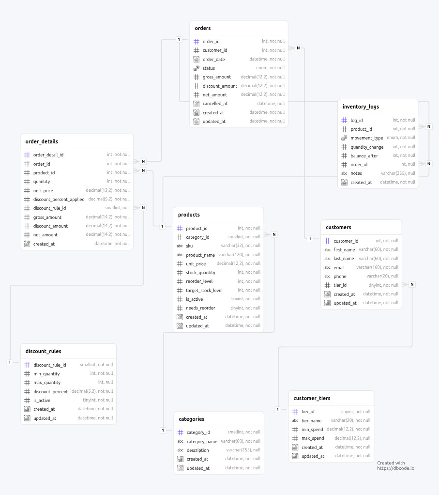

# Inventory and Order Management System

A MySQL database system for an e-commerce company's inventory and order processing, with   business rules traced to the database  that enforces it.

Built against **MySQL 8.4**.

---

## The problem

Manage products, customers, and orders such that stock is correctly deducted when orders are
placed, every inventory movement is auditable, low stock is detected and replenished
automatically, and customers can be segmented by spend. The full brief is preserved verbatim in
[`docs/00-requirements.md`](docs/00-requirements.md) and other  [`documentations/`](doc/).

## Approach

The requirements are written in business proses. 
So the data design and analysis was completed before any DDL was written.

**Analysis and modelling** → requirements  → business rules → conceptual
model → logical model → physical design

**Implementation** → schema → triggers → procedures → views → events → seed data →
reconciliation → tests

<!-- Refactoring a diagram costs minutes; refactoring a schema with triggers, views, and seed data
built on top of it costs hours. -->

## Schema

Eight tables. Five are named by the requirements; three exist to normalise attributes the
requirements left as free text or hardcoded logic — see
[ADR 0001](docs/adr/0001-scope-spec-plus.md).
 
 ### The diagram 
 

 
 

## Documentation

| Document | Contents |
|---|---|
| [00 — Requirements](docs/00-requirements.md) | Source brief, verbatim. The immutable anchor |
| [02 — Business rules](docs/02-business-rules.md) | 40 rules in 4 sections, each with a single named owner |
| [03 — Conceptual model](docs/03-conceptual-model.md) | 8 entities, relationships in business language |
| [04 — Logical model](docs/04-logical-model.md) | Attributes, keys, 3NF walkthrough, defended denormalisations |
| [05 — Physical design](docs/05-physical-design.md) | Engine, charset, type rationale, query-driven index strategy |
| [07 — Traceability matrix](docs/07-traceability-matrix.md) | All 40 rules → their enforcement objects |
| [08 — Performance](docs/08-performance.md) | `Measured at full volume, including what the indexes cost and one prediction they refuted |
| [10 — Future architecture](docs/10-future-architecture.md) | The 19-table production system, scoped out deliberately, with migration paths |
| [ADR 0001](docs/adr/0001-scope-spec-plus.md) | Scope decision |

## Running it

Was run on MySQL 8.4+ with `event_scheduler = ON`.

```bash
mysql < sql/01_schema.sql          # tables, constraints, indexes
mysql < sql/02_triggers.sql        # automation and immutability
mysql < sql/03_reference_data.sql  # tiers, categories, discount bands
mysql < sql/04_procedures.sql      # the business API
mysql < sql/05_views.sql           # reporting surface
mysql < sql/06_events.sql          # hourly replenishment
mysql < sql/07_seed.sql            # 100k orders — takes about 90 seconds
mysql < sql/08_reports.sql         # the reports
mysql < sql/09_reconciliation.sql  # the proofs
mysql < sql/10_grants.sql          # roles
```

Or run the whole sequence in one command, from the repository root:

```bash
mysql < scripts/run-all.sql
```

That script sources the ten files above in order. It leaves `07_seed.sql` commented out, so
the build is structural and fast; uncomment that line for the 100k-order dataset. Because
`01_schema.sql` opens with `DROP TABLE`, run it against a fresh database — it deletes any
data already there.

Check the system's health at any time:

```sql
SELECT * FROM rec_summary;   -- every violations count must be 0
```

Placing an order, once products and a customer exist:

```sql
CALL sp_place_order(1, '[{"product_id":3,"quantity":65},
                         {"product_id":4,"quantity":5}]', @order_id);
```
Scripts run in numerical order. The full sequence rebuilds the entire
system from nothing, which is how the tests work.

```
sql/
  01_schema.sql            tables, constraints, indexes
  02_triggers.sql          ledger application, immutability, totals, tier updates
  03_reference_data.sql    categories, tiers, discount bands
  04_procedures.sql        sp_place_order, sp_cancel_order, sp_replenish_stock
  05_views.sql             vw_order_summary, vw_low_stock, vw_customer_spending
  06_events.sql            ev_replenish_stock, hourly
  07_seed.sql              500 products, 10k customers, 100k orders
  08_reports.sql           nine reports answering the six modelled questions
  09_reconciliation.sql    proofs that every cached value agrees with its source
  10_grants.sql            three roles; no passwords committed
tests/                     negative tests: every constraint and trigger rejects what it should
```

## Status

Analysis and modelling are complete and agreed. Implementation has begun.

| | Progress |
|---|---|
| Documentation | **11 of 11** numbered documents, plus 2 ADRs |
| Schema |  built, idempotent, verified |
| Triggers |  12 triggers + 1 helper routine, verified |
| Procedures |  `sp_place_order`, `sp_cancel_order`, `sp_replenish_stock`, verified |
| Views |  3 views, verified |
| Seed data |  100,000 orders / 250,513 ledger rows, loaded in 91s with every trigger enabled |
| Reconciliation |  8 checks, 0 violations at full volume |
| Privilege model |  3 roles, 11/11 assertions |
| Reports |  9 reports, ~10s at full volume |
| Rules implemented | **40 of 40** — see the [matrix](docs/07-traceability-matrix.md) |
| SQL scripts | **10 of 10** |

 