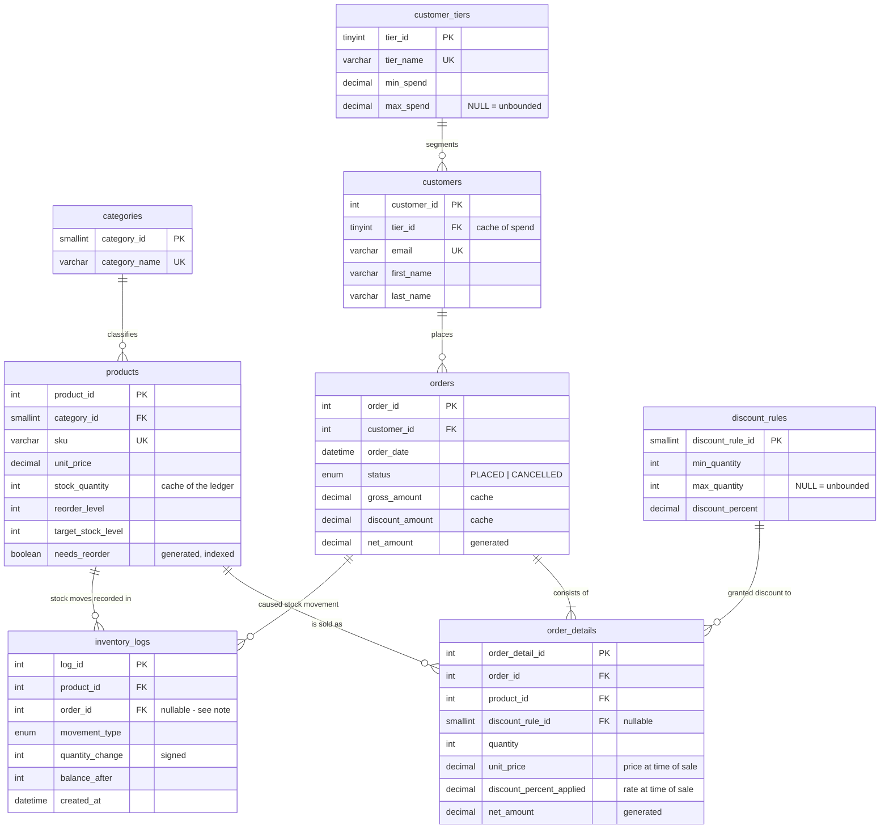

# Inventory and Order Management System

A MySQL database system for an e-commerce company's inventory and order processing — designed
specification-first, with every business rule traced to the database object that enforces it.

Built against **MySQL 8.4**.

---

## The problem

Manage products, customers, and orders such that stock is correctly deducted when orders are
placed, every inventory movement is auditable, low stock is detected and replenished
automatically, and customers can be segmented by spend. The full brief is preserved verbatim in
[`docs/00-requirements.md`](docs/00-requirements.md).

## Approach

The requirements are written in business prose — *"design a way to process new orders"*,
*"design a mechanism to replenish stock"*. They specify outcomes, not implementations. Deciding
which database objects satisfy each outcome, and being able to defend those choices, is the
substance of the work.

So the analysis was completed before any DDL was written:

**Analysis and modelling** → requirements → assumptions register → business rules → conceptual
model → logical model → physical design

**Implementation** → schema → triggers → procedures → views → events → seed data →
reconciliation → tests

Refactoring a diagram costs minutes; refactoring a schema with triggers, views, and seed data
built on top of it costs hours.

## Schema

Eight tables. Five are named by the requirements; three exist to normalise attributes the
requirements left as free text or hardcoded logic — see
[ADR 0001](docs/adr/0001-scope-spec-plus.md).



`inventory_logs.order_id` is a **conditional** relationship: mandatory for `SALE` and
`CANCELLATION` movements, forbidden for `REPLENISHMENT`, `ADJUSTMENT`, and `INITIAL_LOAD`. That
constraint is what makes the table a complete stock history rather than merely a sales history.

## Design decisions worth reading

Five choices shape everything else:

**The inventory log is the source of truth; `stock_quantity` is a cache.** Stock is a *balance*
over an immutable ledger of movements, exactly as an accounting system treats an account. So the
application **writes to the ledger** — `INSERT INTO inventory_logs` — and a trigger applies the
movement to stock. Writing stock directly is rejected. That makes the audit trail structurally
unavoidable rather than merely conventional.
→ [logical model §1](docs/04-logical-model.md), [ADR 0002](docs/adr/0002-ledger-is-the-write-path.md)

**Storing the price on the order line is not redundancy.** `order_details.unit_price` records
what the customer was charged on that date, which is a *different fact* from what the product
costs now. Joining live to `products` would silently re-price every historical order whenever a
price changed. → [logical model §1](docs/04-logical-model.md)

**Every invariant has exactly one owner.** If both a procedure and a trigger deducted stock,
every order would double-deduct. Procedures own the business transaction; triggers own the audit
side effect. → [business rules](docs/02-business-rules.md)

**Business rules are data, not code.** Tier thresholds and bulk-discount breakpoints live in
`customer_tiers` and `discount_rules`. Changing a threshold is an `UPDATE`, not a schema
migration and a redeploy. → [ADR 0001](docs/adr/0001-scope-spec-plus.md)

**Enforced is distinguished from verified.** A `CHECK` constraint makes a rule impossible to
violate. A reconciliation query only detects violations afterwards. Six of the 40 rules are
cross-table aggregates that no constraint can express — they are labelled `VERIFIED`, not quietly
presented as enforced. → [traceability matrix](docs/07-traceability-matrix.md)

## Documentation

| Document | Contents |
|---|---|
| [00 — Requirements](docs/00-requirements.md) | Source brief, verbatim. The immutable anchor |
| [01 — Assumptions](docs/01-assumptions.md) | 30 entries: every question the brief leaves open, and how it was resolved |
| [02 — Business rules](docs/02-business-rules.md) | 40 rules in 4 sections, each with a single named owner |
| [03 — Conceptual model](docs/03-conceptual-model.md) | 8 entities, relationships in business language |
| [04 — Logical model](docs/04-logical-model.md) | Attributes, keys, 3NF walkthrough, defended denormalisations |
| [05 — Physical design](docs/05-physical-design.md) | Engine, charset, type rationale, query-driven index strategy |
| 06 — Data dictionary | *planned* |
| [07 — Traceability matrix](docs/07-traceability-matrix.md) | All 40 rules → their enforcement objects |
| 08 — Performance | *planned* — `EXPLAIN ANALYZE` before and after, at ~100k orders |
| [09 — Requirements coverage](docs/09-requirements-coverage.md) | Every requirement → the artefact satisfying it |
| [10 — Future architecture](docs/10-future-architecture.md) | The 19-table production system, scoped out deliberately, with migration paths |
| [ADR 0001](docs/adr/0001-scope-spec-plus.md) | Scope decision — spec-plus over production-grade |
| [ADR 0002](docs/adr/0002-ledger-is-the-write-path.md) | Why stock is written to the ledger, not to the product row |

## Running it

Requires MySQL 8.4+ with `event_scheduler = ON` and an `sql_mode` including
`STRICT_TRANS_TABLES` — the schema sets the mode itself, and
[§7 of the physical design](docs/05-physical-design.md) explains why it is load-bearing rather
than cosmetic.

```bash
mysql < sql/01_schema.sql          # tables, constraints, indexes
mysql < sql/02_triggers.sql        # automation and immutability
mysql < sql/03_reference_data.sql  # tiers, categories, discount bands
mysql < sql/04_procedures.sql      # the business API
mysql < sql/05_views.sql           # reporting surface
```

Placing an order, once products and a customer exist:

```sql
CALL sp_place_order(1, '[{"product_id":3,"quantity":65},
                         {"product_id":4,"quantity":5}]', @order_id);
```

That one call locks each product in a deadlock-safe order, rejects the whole order if any line is
short of stock, resolves each line's discount band from its own quantity, snapshots the price
charged, moves stock through the ledger, and re-files the customer's tier.

```sql
CALL sp_cancel_order(@order_id);      -- returns stock, re-files the tier
CALL sp_replenish_stock(@n);          -- tops every low product up to target
```

Scripts run in numerical order and are **idempotent** — the full sequence rebuilds the entire
system from nothing, which is how the tests work.

```
sql/
  01_schema.sql          ✅  tables, constraints, indexes
  02_triggers.sql        ✅  ledger application, immutability, totals, tier updates
  03_reference_data.sql  ✅  categories, tiers, discount bands
  04_procedures.sql      ✅  sp_place_order, sp_cancel_order, sp_replenish_stock
  05_views.sql           ✅  vw_order_summary, vw_low_stock, vw_customer_spending
  06_events.sql          ○   ev_replenish_stock
  07_seed.sql            ○   500 products, 10k customers, 100k orders
  08_reports.sql         ○   Phase 3 reporting queries
  09_reconciliation.sql  ○   proofs that every cached value agrees with its source
  10_grants.sql          ○   revoke UPDATE/DELETE on inventory_logs
tests/                   ◐   negative tests: every constraint and trigger rejects what it should
```

## Status

Analysis and modelling are complete and agreed. Implementation has begun.

| | Progress |
|---|---|
| Documentation | 9 of 11 numbered documents, plus 2 ADRs |
| Schema | ✅ built, idempotent, verified |
| Triggers | ✅ 12 triggers + 1 helper routine, verified |
| Procedures | ✅ `sp_place_order`, `sp_cancel_order`, `sp_replenish_stock`, verified |
| Views | ✅ 3 views, verified |
| Rules implemented | 32 of 40 fully, 8 partially, 0 untouched — see the [matrix](docs/07-traceability-matrix.md) |
| SQL scripts | 5 of 10 |

Verified against MySQL 8.4.10. The schema builds from empty and re-runs cleanly, and every
`CHECK` constraint has been shown to reject what it forbids — a stock movement whose sign
disagrees with its reason code, a `SALE` without an order, a `REPLENISHMENT` with one, and
case-differing duplicate emails.

The trigger layer is verified end to end. Stock cannot be written directly or loaded at product
creation; the ledger and its cached balance agree exactly across a mixed sequence of
`INITIAL_LOAD`, `SALE`, and `REPLENISHMENT` movements; the append-only and immutability rules
reject all four forbidden operations; and the tier cascade promotes a customer to Silver on a
large order and demotes them again when it is cancelled — three levels of trigger, each firing
the next.

Order placement is verified end to end. A single call places a multi-product order, merging a
repeated product into one line, resolving each line's discount band from its own quantity,
snapshotting the price charged, deducting stock through the ledger, and moving the customer to
the right tier. Six forbidden calls are rejected — insufficient stock on any one line rejects the
whole order with nothing written, and unknown products, unknown customers, empty orders, retired
products, and double cancellation all fail with rule-named errors. Cancellation returns stock
exactly, and replenishment tops a product from 5 back to its target of 100 and then finds nothing
on a second run.
