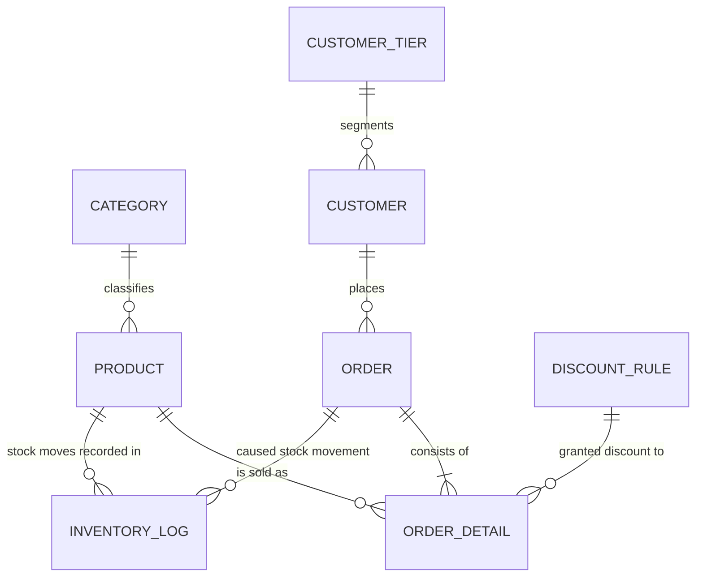

# Conceptual Data Model

The conceptual model answers one question: **what things exist in this business, and how do
they relate?** It deliberately carries no attributes, no data types, and no keys — those
belong to the [logical model](04-logical-model.md). A reader with no database knowledge
should be able to check this diagram against how the business actually works.

## Entities

Eight entities, grouped by the business function they serve.

| Entity | What it represents |
|---|---|
| `CATEGORY` | A grouping of products for merchandising and reporting |
| `PRODUCT` | Something the company sells and holds stock of |
| `CUSTOMER` | A person who places orders |
| `CUSTOMER_TIER` | A spending band used to segment customers for reporting |
| `ORDER` | A single purchase event by one customer |
| `ORDER_DETAIL` | One product, at one quantity, within an order |
| `INVENTORY_LOG` | A single recorded movement of stock, in or out |
| `DISCOUNT_RULE` | A quantity threshold that earns a discount percentage |

## Diagram

## Relationships in business language

Each relationship stated as a sentence the business would recognise, in both directions.
Reading these aloud is the cheapest way to catch a modelling error.

| Relationship | Reading | Optionality |
|---|---|---|
| `CATEGORY` → `PRODUCT` | A category classifies zero or more products. A product belongs to exactly one category. | Mandatory one side |
| `CUSTOMER_TIER` → `CUSTOMER` | A tier segments zero or more customers. Every customer holds exactly one tier — including a customer who has never ordered, who holds the lowest tier. | Mandatory one side |
| `CUSTOMER` → `ORDER` | A customer places zero or more orders. Every order belongs to exactly one customer. | Mandatory one side |
| `ORDER` → `ORDER_DETAIL` | An order consists of **at least one** line. Every line belongs to exactly one order. | Mandatory both sides |
| `PRODUCT` → `ORDER_DETAIL` | A product appears on zero or more order lines, but **at most once within any single order**. | Mandatory one side |
| `PRODUCT` → `INVENTORY_LOG` | A product has zero or more recorded stock movements. Every movement concerns exactly one product. | Mandatory one side |
| `DISCOUNT_RULE` → `ORDER_DETAIL` | A discount rule may have been granted to zero or more lines. A line was granted at most one rule — lines at full price reference none. | **Optional** one side |
| `ORDER` → `INVENTORY_LOG` | An order causes zero or more stock movements. A movement may or may not arise from an order — replenishments and corrections do not. | **Optional** one side |

The two optional relationships are the interesting ones, because they carry business meaning:

- A line with no discount rule is a line sold at full price. Modelling this as optional avoids
  inventing a fictional "0% rule" row.
- A stock movement with no order is a movement that did not come from a sale — a
  replenishment, a stock correction, or the initial load. This is why the inventory log is a
  complete history rather than merely a sales history.

## Questions this model can answer

A conceptual model is worth keeping only if it demonstrably supports the required reporting.
Every question below traces to a phase in [the requirements](00-requirements.md):

- What did each customer order, when, and for how much? *(Phase 3 — order summaries)*
- Which products have fallen to or below their reorder level? *(Phase 3 — low stock)*
- What is each customer's lifetime spend, and which tier does that place them in? *(Phase 3 — customer insights)*
- For any product, what is the complete history of stock movements, and why did each occur? *(Phase 2 — audit)*
- How much revenue was given away as bulk discount, and under which rule? *(Phase 3 — discounts)*
- Which products sell fastest relative to the stock held? *(Phase 3 — monitoring)*

## Naming note

The entity `ORDER` is rendered as the table `orders` in the physical model, because `ORDER` is
a reserved word in SQL and would require back-quoting at every reference. All tables use
plural names for consistency; entities are named in the singular here, which is the
conventional distinction between the two layers.

`ORDER_DETAIL` deliberately follows the vocabulary of [the requirements](00-requirements.md),
which name this entity *"Order Details"*. The prevailing industry term is *order line*, and it
was considered — but matching the specification means every term in the requirements maps to a
schema object without translation, which matters more here than following convention. The
prose in these documents still says "line" where it reads more naturally; the table is
`order_details`.
