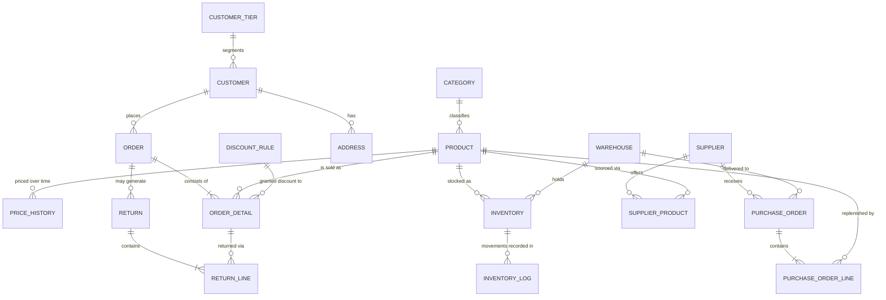

# Future Architecture 

[ADR 0001](adr/0001-scope-spec-plus.md) chose an eight-table model but a still work in progress is a nineteen-table. 
---

## 1. The production model

Nineteen entities across four subject areas. The eight tables that exist today are marked ✅.

| Subject area | Entities |
|---|---|
| **Product & pricing** | `categories` ✅, `products` ✅, `price_history`, `discount_rules` ✅, `customer_tiers` ✅ |
| **Party & sales** | `customers` ✅, `addresses`, `orders` ✅, `order_details` ✅, `returns`, `return_lines` |
| **Inventory** | `warehouses`, `inventory`, `inventory_logs` ✅ |
| **Procurement** | `suppliers`, `supplier_products`, `purchase_orders`, `purchase_order_lines` |

---

## 2. Expansion one — multi-warehouse inventory
 

## 3. Expansion two — procurement
 
 

## 4. Expansion three — reserved stock and available-to-promise

## 5. Expansion four — returns

 