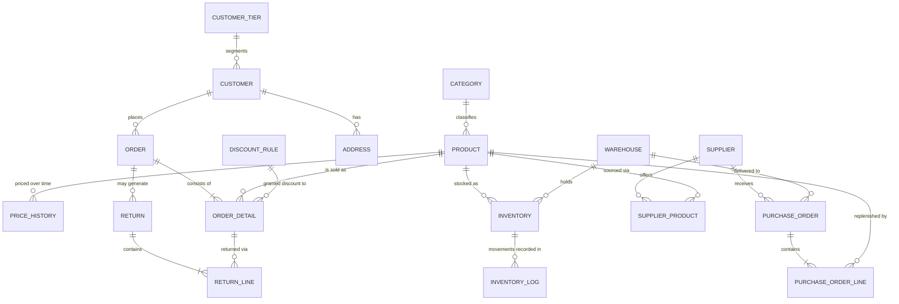

# Future Architecture — the production system this is not

[ADR 0001](adr/0001-scope-spec-plus.md) chose an eight-table model over a nineteen-table one.
This document records what was cut, what it would look like, and how to get there — so that the
omission is a decision on the record rather than a gap someone discovers.

Being able to see the production system and choosing not to build it is a different thing from
not having seen it. This document is the difference.

---

## 1. The production model

Nineteen entities across four subject areas. The eight tables that exist today are marked ✅.

| Subject area | Entities |
|---|---|
| **Product & pricing** | `categories` ✅, `products` ✅, `price_history`, `discount_rules` ✅, `customer_tiers` ✅ |
| **Party & sales** | `customers` ✅, `addresses`, `orders` ✅, `order_details` ✅, `returns`, `return_lines` |
| **Inventory** | `warehouses`, `inventory`, `inventory_logs` ✅ |
| **Procurement** | `suppliers`, `supplier_products`, `purchase_orders`, `purchase_order_lines` |



---

## 2. Expansion one — multi-warehouse inventory

**What changes.** `products.stock_quantity` and `products.reorder_level` are wrong the moment a
second location exists: you might hold 40 units in Accra and none in Kumasi. Stock moves off the
product onto a `product × warehouse` table.

```sql
CREATE TABLE inventory (
  inventory_id       INT UNSIGNED PRIMARY KEY AUTO_INCREMENT,
  product_id         INT UNSIGNED NOT NULL,
  warehouse_id       SMALLINT UNSIGNED NOT NULL,
  quantity_on_hand   INT UNSIGNED NOT NULL DEFAULT 0,
  reorder_level      INT UNSIGNED NOT NULL DEFAULT 0,
  target_stock_level INT UNSIGNED NOT NULL,
  UNIQUE (product_id, warehouse_id)
);
```

**Consequences that ripple outward:**

- Reorder levels become per product **per location**, so the low-stock report and the
  `needs_reorder` flag move to `inventory`.
- `inventory_logs` gains `warehouse_id`. The ledger is then per location, and rule I-08's
  reconciliation groups by `(product_id, warehouse_id)`.
- A new movement type, `TRANSFER`, appears — recorded as a **pair** of rows (negative at the
  source, positive at the destination) so that the sum across all warehouses stays invariant.
  The pairing is what makes a transfer distinguishable from an unexplained loss at one site and
  an unexplained gain at another.
- `sp_place_order` must decide *which* location fulfils each line — an allocation policy that
  does not exist today.

**Migration path.** Non-destructive and reversible:

1. Create `warehouses` and seed a single `DEFAULT` row.
2. Create `inventory`; backfill one row per product from `products`, all pointing at `DEFAULT`.
3. Add `inventory_logs.warehouse_id`, backfill to `DEFAULT`, then set `NOT NULL`.
4. Repoint the views and procedures at `inventory`.
5. Drop `products.stock_quantity`, `reorder_level`, `target_stock_level`, `needs_reorder`.

Step 5 is the only irreversible one, and it can lag the others indefinitely.

---

## 3. Expansion two — procurement

**What changes.** Today `sp_replenish_stock` conjures stock into existence: assumption
[A-08](01-assumptions.md). Real replenishment is a process with a counterparty and a delay.

Replenishment becomes three distinct events rather than one:

| Event | Effect on stock |
|---|---|
| Purchase order raised | None. Stock is *expected*, not present |
| Purchase order received | `+quantity`, logged as `RECEIPT` |
| Discrepancy on receipt | `ADJUSTMENT`, with the shortfall in `notes` |

**The design trap worth flagging.** `inventory_logs.order_id` currently records what caused a
movement. With purchase orders, a movement can be caused by a sales order *or* a purchase order.
The tempting solution is a polymorphic pair — `source_type` plus `source_id` — and it is a
mistake: no foreign key can constrain `source_id`, so referential integrity is lost precisely
where an audit trail needs it most.

The correct shape is two nullable foreign keys and a constraint that exactly one is populated:

```sql
order_id          INT UNSIGNED NULL REFERENCES orders (order_id),
purchase_order_id INT UNSIGNED NULL REFERENCES purchase_orders (purchase_order_id),

CHECK (
  (movement_type IN ('SALE','CANCELLATION','RETURN')
     AND order_id IS NOT NULL AND purchase_order_id IS NULL)
  OR
  (movement_type = 'RECEIPT'
     AND purchase_order_id IS NOT NULL AND order_id IS NULL)
  OR
  (movement_type IN ('ADJUSTMENT','TRANSFER','INITIAL_LOAD')
     AND order_id IS NULL AND purchase_order_id IS NULL)
)
```

More columns, real integrity. This is the same conditional-relationship pattern already used by
`chk_inventory_logs_order_presence`, extended rather than replaced.

**Also needed:** `supplier_products` carries cost price and lead time per supplier per product,
which is what makes *"reorder from whom, and when will it arrive?"* answerable. Automated
replenishment must then be **idempotent** — a scheduled job that runs hourly must not raise a
fresh purchase order for a product that already has one outstanding.

---

## 4. Expansion three — reserved stock and available-to-promise

**What changes.** This is the deepest change, and the one that most justifies the label
*production-grade*.

Today stock is deducted at placement (assumption [A-03](01-assumptions.md)). In reality an order
passes through states where units are *claimed but still physically present*: picked, packed,
awaiting despatch. Selling against physical stock oversells; selling against nothing at all
undersells.

```
available_to_promise = quantity_on_hand − quantity_reserved
```

**Consequences:**

- `inventory` gains `quantity_reserved`, with `CHECK (quantity_reserved <= quantity_on_hand)`.
- `orders.status` grows to `PENDING → CONFIRMED → PICKED → SHIPPED`, plus `CANCELLED`. The
  two-state model of rule O-03 exists *only* because nothing is provisional; the moment
  reservations exist, states earn their keep.
- `sp_place_order` reserves rather than deducts. A second procedure, `sp_ship_order`, converts
  reservation into deduction and writes the `SALE` movement.
- Every stock rule acquires a second dimension: not *"is there enough stock?"* but *"is there
  enough **unreserved** stock?"*
- Abandoned reservations need expiry, which means a scheduled release job and a
  `reserved_until` timestamp.

This roughly doubles the inventory rule set, which is why it was cut.

---

## 5. Expansion four — returns

The smallest expansion, because the groundwork is already laid. `RETURN` exists in the
`movement_type` enum and is already covered by the sign and order-presence constraints
(assumption [A-26](01-assumptions.md)) — it is simply never produced.

What is missing is the paperwork: `returns` and `return_lines`, where a return line references
the original `order_detail` so the refund uses the **price actually charged** rather than
today's price. That is rule O-08's snapshot principle applied a second time.

Returns also complicate lifetime spend: rule T-03 excludes cancelled orders, and it would need
to net off refunds too, or a customer could return everything and stay Gold.

---

## 6. Sequencing

Dependency order, if this were ever built:

1. **Multi-warehouse** — foundational; everything else assumes stock has a location
2. **Procurement** — depends on warehouses (a purchase order is delivered *somewhere*)
3. **Returns** — independent, and small; could come at any point
4. **Reservations / ATP** — last, because it touches every rule written by then

Attempting reservations before warehouses would mean writing the reservation logic twice.

---

## 7. What would not change

The reason this expansion is credible rather than speculative: the patterns already chosen
survive all four steps intact.

| Pattern | Still holds because |
|---|---|
| **Ledger of record + cached balance** | `inventory.quantity_on_hand` becomes the cache and `inventory_logs` remains the truth. Rule I-08 gains a `GROUP BY` clause; its logic is unchanged |
| **Snapshot temporal facts** | Return lines need the price charged, not today's price — the same reasoning as `order_details.unit_price` |
| **One owner per invariant** | Still the rule that keeps `sp_ship_order` and the logging trigger from double-counting |
| **Business rules as data** | `discount_rules` and `customer_tiers` are joined by supplier lead times and allocation policies, not replaced |
| **Enforced vs verified** | Reconciliation queries multiply; the classification does not change |
| **Conditional relationships via `CHECK`** | Extended by the two-nullable-keys pattern in §3, not abandoned |

Nothing in the current design has to be undone to reach the production model. Every step is
additive. That is the strongest argument that the scope cut was a deferral rather than a
shortcut.
